# 🚀 Render Deployment Walkthrough - RAC Backend

## Overview

This walkthrough will deploy your RAC backend to Render's free tier, connecting to your MongoDB Atlas database.

**What you'll get:**
- Live backend API at `https://rac-backend-XXXX.onrender.com`
- Automatic deployments on GitHub push
- Free 750 hours/month (spins down after 15min inactivity)

---

## Step 1: Create Render Account

1. **Open Render**: [https://render.com](https://render.com)
2. Click **"Get Started for Free"**
3. **Sign Up Options**:
   - ✅ **Recommended:** "Sign up with GitHub" (easier integration)
   - Or use email/Google
4. If using GitHub:
   - Authorize Render to access your repositories
   - You can limit access to specific repos or grant all access

---

## Step 2: Create New Web Service

1. Once logged in, click **"New +"** (top right)
2. Select **"Web Service"**
3. **Connect Repository:**
   - If you used GitHub login, you'll see your repos
   - Find: **`poratls_of_rac`**
   - Click **"Connect"**

> **Note:** If you don't see your repository, click "Configure account" and grant Render access.

---

## Step 3: Configure Service Settings

Fill in the following settings:

### Basic Settings

| Field | Value | Description |
|-------|-------|-------------|
| **Name** | `rac-backend` | Service name (will be in URL) |
| **Region** | `Oregon (US West)` | Or closest to you |
| **Branch** | `main` | Your main branch |
| **Root Directory** | `backend` | ⚠️ Important! |
| **Environment** | `Node` | Auto-detected |

### Build & Deploy Commands

| Setting | Value |
|---------|-------|
| **Build Command** | `npm install` |
| **Start Command** | `npm start` |

### Instance Type

- Select: **Free** ($0/month)
- ⚠️ Free tier sleeps after 15min inactivity (30s cold start)

---

## Step 4: Add Environment Variables

**Critical step!** Click **"Advanced"** to expand environment variables section.

Click **"Add Environment Variable"** for each of these:

### Database Configuration

```env
MONGODB_URI
```
**Value:** Your MongoDB Atlas connection string from earlier
```
mongodb+srv://prasanth0544:<your-password>@cluster0.1k4cf.mongodb.net/rac?retryWrites=true&w=majority
```

### Database Names & Collections

```env
STATIONS_DB=rac
STATIONS_COLLECTION=17225
PASSENGERS_DB=PassengersDB
PASSENGERS_COLLECTION=17225_passengers
TRAIN_DETAILS_DB=rac
TRAIN_DETAILS_COLLECTION=Trains_Details
DEFAULT_TRAIN_NO=17225
```

> **Important:** Use `PassengersDB` (with capital P, D, B) - this matches your MongoDB Atlas structure.

### Authentication & Security

```env
JWT_SECRET=rac-reallocation-secret-key-change-this-in-production-min-32-chars
JWT_EXPIRES_IN=24h
```

### Server Configuration

```env
NODE_ENV=production
PORT=5000
LOG_LEVEL=INFO
```

### VAPID Keys (Push Notifications)

**Generate these first** if you haven't already:
```bash
npx web-push generate-vapid-keys
```

Then add:
```env
VAPID_PUBLIC_KEY=BEl62iUYgUivxIkv69yViEuiBIa-Ib9-SkvMeAtA3LFgDzkrxZJjSgSnfckjBJuBkr3qBUYIHBQFLXYp5Nksh8U
VAPID_PRIVATE_KEY=UUxI4O8-FbRouAf7-7PVTv1qCIqAThH7t6lFQCRVnDY
VAPID_EMAIL=admin@example.com
```

### CORS (Temporary - we'll update later)

```env
ALLOWED_ORIGINS=http://localhost:3000,http://localhost:5174,http://localhost:5175
```

> **Note:** We'll update this with your Vercel URLs after deploying frontends

---

## Step 5: Deploy!

1. **Review** all settings carefully
2. Click **"Create Web Service"** (bottom of page)
3. **Wait for deployment** (5-10 minutes for first deploy)

### What Happens Now:

```mermaid
graph LR
    A[Render clones your repo] --> B[Installs dependencies]
    B --> C[Runs npm install]
    C --> D[Starts with npm start]
    D --> E[Health checks pass]
    E --> F[Service LIVE! 🎉]
```



**Watch the logs** in real-time to see progress.

---

## Step 6: Monitor Deployment

### Understanding the Logs

You'll see output like:
```
==> Cloning from https://github.com/Prasanth0544/poratls_of_rac...
==> Running 'npm install' in /opt/render/project/src/backend
==> Running 'npm start'
✅ Server running on port 5000
✅ MongoDB connected successfully
✅ WebSocket server initialized
```

### Status Indicators

| Icon | Status | Meaning |
|------|--------|---------|
| 🟡 | Building | Installing dependencies |
| 🔵 | Deploying | Starting service |
| 🟢 | Live | Service is running! |
| 🔴 | Failed | Check logs for errors |

---

## Step 7: Get Your Service URL

Once deployment succeeds (status shows **🟢 Live**):

1. Look at the top of the page
2. You'll see your service URL: `https://rac-backend-XXXX.onrender.com`
3. **Copy this URL** - you'll need it for frontend deployment

---

## Step 8: Test Your Backend

### A. Health Check

Open in browser or use curl:
```bash
curl https://YOUR-SERVICE-URL.onrender.com/api/health
```

**Expected response:**
```json
{
  "status": "ok",
  "timestamp": "2025-12-25T06:35:26.000Z",
  "database": "connected",
  "uptime": 123
}
```

### B. Check Database Connection

In the Render dashboard:
1. Click **"Shell"** tab
2. Run:
```bash
node -e "console.log('Database:', process.env.MONGODB_URI ? 'Configured' : 'Missing')"
```

### C. Initialize Database Accounts

In the **Shell** tab, run:
```bash
node scripts/createTestAccounts.js
```

**Expected output:**
```
✅ Admin account created: ADMIN_01
✅ TTE account created: TTE_01
✅ Passenger account created: IR_0001
```

---

## Step 9: Verify API Endpoints

Test these endpoints in your browser:

| Endpoint | URL | Expected |
|----------|-----|----------|
| Health | `https://YOUR-URL.onrender.com/api/health` | `{"status":"ok"}` |
| API Docs | `https://YOUR-URL.onrender.com/api-docs` | Swagger UI |
| CSRF Token | `https://YOUR-URL.onrender.com/api/csrf-token` | JSON with token |

---

## ⚠️ Important Notes

### Free Tier Limitations

- **Sleeps after 15 minutes** of inactivity
- **First request** after sleep takes ~30 seconds (cold start)
- **750 hours/month** free (enough for continuous use)

**To upgrade:** $7/month for always-on service

### Auto-Deployment

- Every `git push` to `main` branch triggers automatic redeploy
- Takes ~2-3 minutes
- No manual steps needed!

---

## 🐛 Troubleshooting

### "Build failed" Error

**Check:**
1. Root Directory is set to `backend`
2. `package.json` exists in backend folder
3. Dependencies install successfully locally

**Fix:** View logs for exact error, usually missing dependencies

### "Application failed to respond" Error

**Check:**
1. Start command is `npm start`
2. Backend listens on `process.env.PORT` (not hardcoded 5000)
3. MongoDB connection string is correct

**Fix:** Click "Shell" and run `npm start` manually to see errors

### Database Connection Failed

**Check:**
1. MongoDB Atlas Network Access allows `0.0.0.0/0`
2. `MONGODB_URI` environment variable is correct
3. Password doesn't have special characters needing URL encoding

**Fix:** Test connection string locally first

### CORS Errors (After Deploying Frontend)

**When:** Frontend can't connect to backend

**Fix:**
1. Go to Render → Environment tab
2. Update `ALLOWED_ORIGINS` with your Vercel URLs
3. Save (triggers automatic redeploy)

---

## ✅ Success Checklist

- [ ] Service status shows **🟢 Live**
- [ ] Health endpoint returns `{"status":"ok"}`
- [ ] Can access Swagger docs at `/api-docs`
- [ ] Test accounts created successfully
- [ ] MongoDB connection confirmed in logs
- [ ] Service URL copied for frontend deployment

---

## 🎯 Next Steps

Now that your backend is deployed:

1. **Deploy Frontends** to Vercel (3 separate apps)
2. **Update CORS** in Render with Vercel URLs
3. **Test end-to-end** functionality

**See:** [VERCEL_WALKTHROUGH.md](VERCEL_WALKTHROUGH.md) for frontend deployment guide

---

## 📋 Quick Reference

**Your Service Details:**
- Name: `rac-backend`
- Region: `Oregon (US West)`
- URL: `https://rac-backend-XXXX.onrender.com`
- Plan: Free (750 hrs/month)
- Branch: `main`
- Auto-deploy: ✅ Enabled

**Useful Links:**
- Render Dashboard: [https://dashboard.render.com](https://dashboard.render.com)
- Service Logs: Click your service → "Logs" tab
- Shell Access: Click your service → "Shell" tab
- Environment Variables: Click your service → "Environment" tab

---

## 💡 Pro Tips

1. **Bookmark your service URL** - you'll use it often
2. **Keep shell tab open** - useful for running scripts
3. **Monitor logs** during first few API calls
4. **Set up notifications** - Render can alert you of failures
5. **Use environment groups** - Reuse configs across services

---

**Your backend is now live and accessible worldwide!** 🌍

*Last Updated: December 25, 2025*
