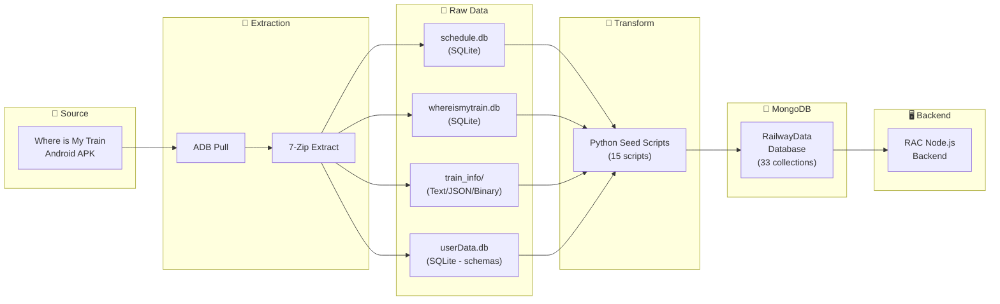
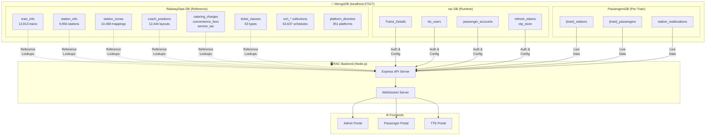

# 🚂 Railway App Data Extraction & Integration

> Full technical documentation of extracting railway data from the **"Where is My Train"** Android app and integrating it into the RAC (Railway Allocation & Confirmation) project's MongoDB backend.

## 🎯 What is this document about?

The **RAC project** is a railway berth management system that handles passenger seat allocation, waitlist upgrades, and real-time train operations. To power this system, we needed a **comprehensive Indian Railways dataset** — train details, station information, coach layouts, fare structures, zone mappings, and schedules.

Rather than manually compiling this data, we extracted it from **"Where is My Train"** — a widely-used Indian Railways app (developed by Sigmoid Labs, later acquired by Google). This app ships with a rich offline dataset embedded inside its APK (Android application package). We reverse-engineered the APK to extract this data and imported it into our project's MongoDB database.

This document covers the **complete end-to-end process** — from pulling the APK off an Android phone to having a fully populated MongoDB database with 33 collections and over 110,000 documents.

---

## 📋 Table of Contents

1. [Tools Used](#-tools-used)
2. [Data Extraction Process](#-data-extraction-process)
3. [Extracted Data Overview](#-extracted-data-overview)
4. [Dataset Pipeline](#-dataset-pipeline)
5. [System Architecture](#-system-architecture)
6. [MongoDB Collections](#-mongodb-collections)
7. [Seed Scripts](#-seed-scripts)

---

## 🛠️ Tools Used

The following tools were used at various stages of the extraction and integration process. No paid software or special hardware was required — everything is open-source or freely available.

| Tool | Purpose |
|------|---------|
| **ADB Platform Tools** | Android Debug Bridge — communicates with the phone over USB to pull app files |
| **7-Zip** | Extracts APK contents (an APK is essentially a ZIP archive containing all app resources) |
| **DB Browser for SQLite** | GUI tool to visually inspect the SQLite databases found inside the APK |
| **Python 3 + pymongo** | Custom scripts to parse extracted data, transform it, and load it into MongoDB |
| **MongoDB Compass** | GUI tool to verify that all collections were correctly imported |

---

## 📱 Data Extraction Process

The extraction process involves connecting an Android phone (which has the app installed) to a laptop, pulling the APK file, and then extracting its embedded data assets. Here's how it was done:

### Step 1: Enable Developer Mode & USB Debugging

Android phones hide developer tools by default. To access them, we need to enable "Developer Options" and turn on "USB Debugging", which allows the laptop to communicate with the phone.

```
Settings → About Phone → Tap Build Number 7 times
Settings → Developer Options → Enable USB Debugging
```

### Step 2: Connect Device & Verify

Once USB Debugging is enabled, we connect the phone to the laptop via USB and verify that ADB (Android Debug Bridge) can see the device.

```bash
# Connect phone via USB (File Transfer Mode)
adb devices
# Output: 10BD8H0KHG000AN   device
```

### Step 3: Locate & Pull APK

Every Android app is stored as an APK file on the device. We find the exact path of the "Where is My Train" app's APK and download it to the laptop.

```bash
# Find package
adb shell pm list packages | findstr train
# Result: package:com.whereismytrain.android

# Get APK path
adb shell pm path com.whereismytrain.android
# Result: /data/app/~~YEP.../com.whereismytrain.android/base.apk

# Pull to laptop
adb pull /data/app/~~YEP.../com.whereismytrain.android/base.apk
```

### Step 4: Extract APK

An APK file is just a ZIP archive with a different extension. We extract it to access the app's embedded resources — databases, configuration files, images, and binary data files.

```bash
7z x base.apk -o"RailWayData"
```

**After extraction, the key data lives inside the `assets/` folder:**
```
base/
├── assets/
│   ├── databases/          ← 6 SQLite databases
│   ├── train_info/         ← Coach layouts, zone mappings, fare data
│   ├── local/              ← 11 language translations (binary encoded)
│   ├── explore/            ← Station details (protobuf)
│   ├── events/             ← Special event trains (protobuf)
│   ├── t/                  ← Precomputed route index (binary)
│   ├── sch_map_*.png       ← Metro maps (5 cities)
│   ├── data_timestamp.txt  ← April 2025
│   └── data_version.txt   ← v7.2.9
├── classes.dex             ← Compiled Java code
├── AndroidManifest.xml
└── res/                    ← UI resources
```

---

## 📊 Extracted Data Overview

The extracted APK contained a rich dataset organized across **SQLite databases** (structured relational data) and **custom data files** (text, JSON, and proprietary binary formats). Here's what was found:

### SQLite Databases (6 files)

SQLite is a lightweight database format commonly used by mobile apps for offline storage. The app ships with 6 pre-populated databases:

| Database | Tables | Records | Content |
|----------|--------|---------|---------|
| **whereismytrain.db** | 10 | 23,895 | Master train & station catalog |
| **schedule.db** | 7 | 63,637 | Metro/local train schedules |
| **cinfo.db** | — | — | App configuration |
| **userData.db** | 8 | 0 | Runtime schemas (empty) |
| **alarm.db** | 1 | 0 | Location alarm schema |
| **chat.db** | 1 | 0 | Feedback schema |

### Train Info Files

Beyond the databases, the app stores additional data in custom file formats inside the `train_info/` folder. Some are human-readable (text, JSON), while others use proprietary binary encoding:

| File | Format | Records | Content |
|------|--------|---------|---------|
| `coach_positions.txt` | Pipe-delimited | 12,444 | Coach layouts for all trains |
| `classes_gid.txt` | Text | 11 | Ticket class codes |
| `kodu` | Pipe-delimited | 9,414 | Station → Zone mappings |
| `mankatha_part_2` | JSON | 65 | Catering charges & convenience fees |
| `mankatha_vari` | JSON | 27 | Service tax rules |
| `boondi` | Binary | — | Compressed internal index |
| `munthiri` | Binary | — | Packed GPS coordinates |
| `station_clusters.bin` | Binary | — | Geographic station clusters |

> **Fun fact:** File names like *boondi*, *munthiri*, *mankatha*, *ladoo* are Tamil/Hindi food & movie names — a common obfuscation practice by the Chennai-based dev team (Sigmoid Labs, acquired by Google).

### Final Dataset Size

| Category | Count |
|----------|-------|
| Trains | 12,813 |
| Stations | 9,956 |
| Schedule Stations | 778 |
| Stop Time Records | 35,950 |
| Coach Layouts | 12,444 |
| Station-Zone Mappings | 10,458 |
| Ticket/Coach Classes | 63 |
| Fare Rules | 92 |

---

## 🔄 Dataset Pipeline

The overall data flow follows a classic **ETL (Extract, Transform, Load)** pattern. Raw data is extracted from the APK, transformed into clean MongoDB documents using Python scripts, and loaded into the `RailwayData` database where the backend can query it.



### Pipeline Steps (in detail)

Each step in the pipeline serves a specific purpose:

| Step | Tool | Input | Output |
|------|------|-------|--------|
| 1. **Pull** | ADB | Phone APK | `base.apk` |
| 2. **Extract** | 7-Zip | `base.apk` | `assets/` folder |
| 3. **Parse** | Python + sqlite3 | SQLite DBs + text files | Structured dicts |
| 4. **Transform** | Python scripts | Raw records | Cleaned documents (human-readable mappings) |
| 5. **Load** | pymongo | Documents | MongoDB `RailwayData` collections |
| 6. **Index** | pymongo | Collections | Optimized query indexes |

---

## 🏗️ System Architecture

The RAC project uses **three separate MongoDB databases**, each serving a distinct role. The `RailwayData` database (populated through this extraction process) serves as a **read-only reference catalog** that the backend queries when it needs train details, station information, fare calculations, or coach layouts.



### How the three databases work together

The separation into three databases follows the principle of **separating reference data from operational data**:

| Database | Role | Access |
|----------|------|--------|
| **RailwayData** | 📚 Reference catalog — trains, stations, fares, schedules, zones | Read-only lookups |
| **rac** | 🔐 Auth & config — users, tokens, train configurations | Read/Write |
| **PassengersDB** | 🚃 Live operations — passengers, berths, reallocations | Read/Write (per-train) |

---

## 🍃 MongoDB Collections

After running all seed scripts, the `RailwayData` database contains **33 collections** totaling over **110,000 documents**. Collections are organized into two categories:

### RailwayData Database — 33 Collections

#### 📊 Data Collections (populated with extracted records)

| Collection | Documents | Source |
|------------|-----------|--------|
| `train_info` | 12,813 | whereismytrain.db |
| `station_info` | 9,956 | whereismytrain.db |
| `coach_positions` | 12,444 | coach_positions.txt |
| `station_zones` | 10,458 | kodu |
| `sch_stop_times` | 35,950 | schedule.db |
| `sch_trips` | 25,826 | schedule.db |
| `station_aka_info` | 775 | whereismytrain.db |
| `sch_stations` | 778 | schedule.db |
| `sch_station_names` | 778 | schedule.db |
| `platform_direction` | 351 | whereismytrain.db |
| `sch_platform_sequence` | 237 | schedule.db |
| `ticket_classes` | 63 | classes_gid.txt + coach_positions.txt |
| `sch_lines` | 43 | schedule.db |
| `catering_charges` | 34 | mankatha_part_2 |
| `convenience_fees` | 31 | mankatha_part_2 |
| `service_tax` | 27 | mankatha_vari |
| `sch_trip_calendar` | 25 | schedule.db |

#### 📋 Schema-Only Collections (empty templates)

These collections were empty in the source app (they get populated at runtime when users interact with the app). We created them in MongoDB with **schema validation rules** so they're ready to accept data when the RAC app starts using them:

| Collection | Source | Purpose |
|------------|--------|---------|
| `passenger_details` | userData.db | Passenger profiles |
| `train_history` | userData.db | Train search history |
| `pnr_status` | userData.db | PNR tracking |
| `pnr_jobs` | userData.db | PNR check scheduler |
| `pnr_updates` | userData.db | PNR status changes |
| `pnr_notifications` | userData.db | PNR push notifications |
| `pnr_retry` | userData.db | PNR retry logic |
| `location_alarms` | alarm.db | Location-based alerts |
| `chat_history` | chat.db | Feedback messages |
| `live_station_history` | userData.db | Frequent station pairs |
| `from_to_suggestions` | whereismytrain.db | Search suggestions |
| `station_aka_info_local` | whereismytrain.db | Local language aliases |
| `station_info_local` | whereismytrain.db | Local language names |
| `train_aka_info` | whereismytrain.db | Train alternate names |
| `train_aka_info_local` | whereismytrain.db | Train local names |
| `train_info_local` | whereismytrain.db | Train local info |

---

## 🐍 Seed Scripts

Each collection has a corresponding **Python seed script** that handles the extraction, transformation, and loading. All scripts are self-contained — they read from the source files, transform the data (e.g., mapping integer codes to human-readable names), and insert into MongoDB.

All scripts are located in the `Railway_data/` folder:

| Script | Collections | Docs |
|--------|------------|------|
| `seed_whereismytrain.py` | 10 collections (train_info, station_info, etc.) | 23,895 |
| `seed_schedule.py` | 7 collections (sch_*) | 63,637 |
| `seed_station_zones.py` | station_zones | 10,458 |
| `seed_coach_positions.py` | coach_positions | 12,444 |
| `seed_ticket_classes.py` | ticket_classes | 63 |
| `seed_catering_charges.py` | catering_charges | 34 |
| `seed_convenience_fees.py` | convenience_fees | 31 |
| `seed_service_tax.py` | service_tax | 27 |
| `seed_passenger_details.py` | passenger_details | 0 |
| `seed_train_history.py` | train_history | 0 |
| `seed_pnr_status.py` | pnr_status | 0 |
| `seed_pnr_collections.py` | pnr_jobs, pnr_updates, pnr_notifications, pnr_retry | 0 |
| `seed_location_alarms.py` | location_alarms | 0 |
| `seed_chat_history.py` | chat_history | 0 |
| `seed_live_station_history.py` | live_station_history | 0 |

### How to run all seeds

To populate the entire `RailwayData` database from scratch, run these commands in order. Each script is idempotent — it drops and recreates its collection, so it's safe to run multiple times.

```bash
cd Railway_data
python seed_whereismytrain.py
python seed_schedule.py
python seed_station_zones.py
python seed_coach_positions.py
python seed_ticket_classes.py
python seed_catering_charges.py
python seed_convenience_fees.py
python seed_service_tax.py
python seed_passenger_details.py
python seed_train_history.py
python seed_pnr_status.py
python seed_pnr_collections.py
python seed_location_alarms.py
python seed_chat_history.py
python seed_live_station_history.py
```

> **Prerequisite:** `pip install pymongo`

---

## 🧠 Skills Demonstrated

- Android reverse engineering (ADB + APK extraction)
- SQLite database analysis
- Binary file format investigation
- Data engineering & ETL pipeline
- MongoDB schema design with validation rules
- Python scripting for data transformation
- System architecture design

---

*Data snapshot: April 2025 | App version: 7.2.9 | Source: Where is My Train (by Sigmoid Labs / Google)*