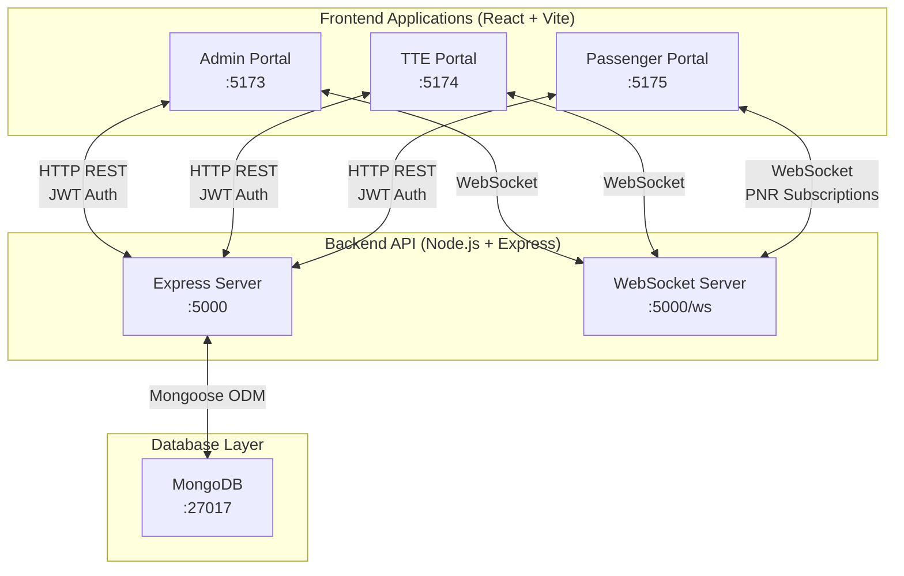
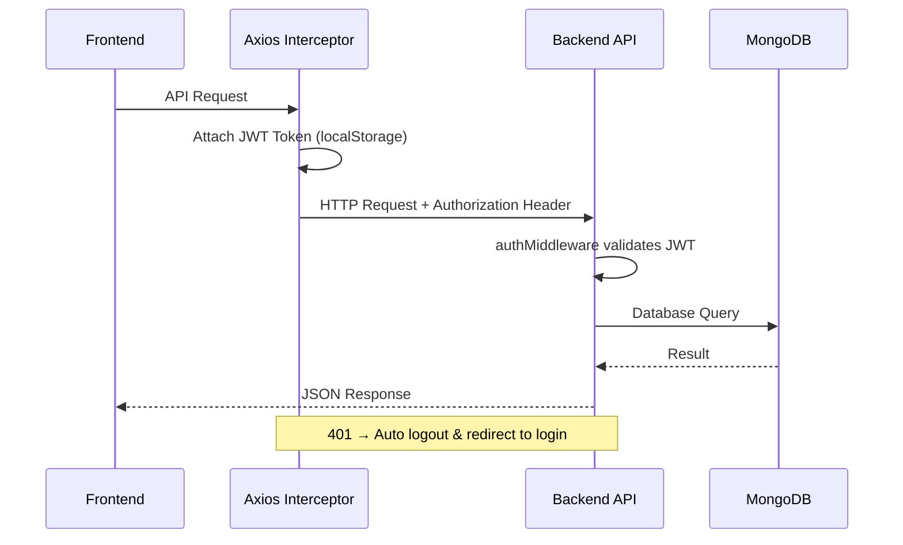
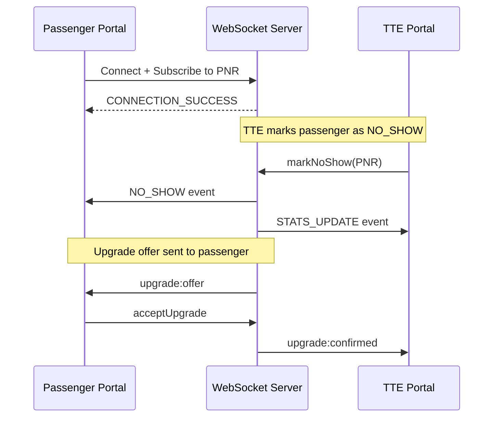
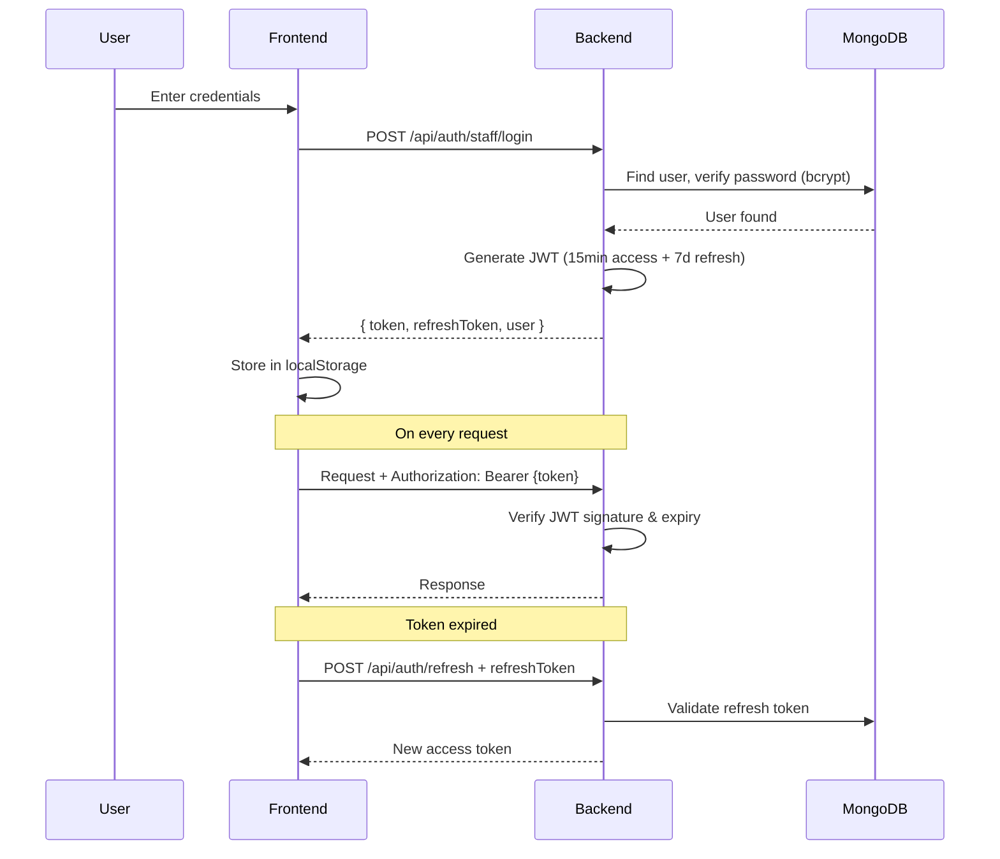

# 🏗️ RAC Reallocation System - Architecture

A comprehensive architecture document detailing connections, communication flows, and system design.

---

## System Overview



---

## Communication Patterns

### 1. HTTP REST Communication

All frontends communicate with the backend via **Axios HTTP client** with JWT authentication.



### 2. WebSocket Real-time Communication

WebSocket provides **real-time updates** without polling.



---

## API Architecture

### Endpoint Categories (80+ endpoints)

| Category | Endpoints | Authentication |
|----------|-----------|----------------|
| **Auth** | `/api/auth/*` | Public (login) / JWT (verify, logout) |
| **Train** | `/api/train/*` | Optional |
| **Passenger** | `/api/passenger/*` | JWT for mutations |
| **TTE** | `/api/tte/*` | JWT + Role: TTE/ADMIN |
| **Reallocation** | `/api/reallocation/*` | JWT + Role: TTE/ADMIN |
| **Visualization** | `/api/visualization/*` | Optional |
| **Push** | `/api/push/*`, `/api/passenger/push-*` | Optional |

### Request Flow

```
Frontend Request
    ↓
Rate Limiter (express-rate-limit)
    ↓
CORS Middleware (cors)
    ↓
Body Parser (express.json)
    ↓
JWT Auth Middleware (middleware/auth.js)
    ↓
Role Check Middleware (requireRole)
    ↓
Validation Middleware (Zod/Joi schemas)
    ↓
Controller
    ↓
Service Layer
    ↓
Database (MongoDB via Mongoose)
    ↓
Response + WebSocket Broadcast
```

---

## Backend Service Architecture

### 21 Service Classes

```
services/
├── CacheService.js          # In-memory caching (node-cache)
├── CurrentStationReallocationService.js  # Station-wise matching
├── DataService.js            # Database operations
├── InAppNotificationService.js  # In-app notifications
├── NotificationService.js    # Unified notification dispatch
├── OTPService.js             # OTP generation & validation
├── PassengerService.js       # Passenger operations
├── PushNotificationService.js   # Web push notifications
├── PushSubscriptionService.js   # Subscription management
├── QueueService.js           # Queue operations
├── RACHashMapService.js      # RAC queue hashmap
├── ReallocationService.js    # Reallocation logic
├── RefreshTokenService.js    # JWT refresh tokens
├── SegmentService.js         # Segment utilities
├── StationEventService.js    # Station arrival events
├── StationWiseApprovalService.js  # TTE approval workflow
├── UpgradeNotificationService.js  # Upgrade notifications
├── ValidationService.js      # Business validation
├── VisualizationService.js   # Data visualization
├── WebPushService.js         # Web push implementation
└── reallocation/             # Reallocation sub-services
    ├── AllocationService.js
    ├── EligibilityService.js
    ├── RACQueueService.js
    ├── SegmentVacancyService.js
    ├── VacancyService.js
    └── VacancyTrackingService.js
```

---

## Frontend Architecture

### API Service Pattern (All 3 Portals)

Each portal has a centralized API service with:
- **Axios instance** with base URL configuration
- **Request interceptor** for JWT token injection
- **Response interceptor** for 401 handling (auto logout)

```typescript
// Example: All frontends follow this pattern
const api = axios.create({
    baseURL: 'http://localhost:5000/api',
    headers: { 'Content-Type': 'application/json' }
});

api.interceptors.request.use((config) => {
    const token = localStorage.getItem('token');
    if (token) {
        config.headers.Authorization = `Bearer ${token}`;
    }
    return config;
});
```

### Portal Responsibilities

| Portal | Role | Key Features |
|--------|------|--------------|
| **Admin Portal** (`:5173`) | System admin | Train init, passenger view, reallocation apply, visualizations |
| **TTE Portal** (`:5174`) | Train Ticket Examiner | Mark no-show, boarding verification, upgrade approval, offline upgrades |
| **Passenger Portal** (`:5175`) | Passengers | PNR lookup, upgrade accept/deny, boarding pass, self-cancel |

---

## WebSocket Events

### Event Types

| Event | Direction | Purpose |
|-------|-----------|---------|
| `CONNECTION_SUCCESS` | Server → Client | Connection confirmed |
| `TRAIN_UPDATE` | Server → All | Train state changed |
| `STATION_ARRIVAL` | Server → All | Train arrived at station |
| `RAC_REALLOCATION` | Server → All | Reallocation occurred |
| `NO_SHOW` | Server → All | Passenger marked no-show |
| `STATS_UPDATE` | Server → All | Statistics changed |
| `upgrade:offer` | Server → PNR subscribers | Upgrade offer for specific passenger |
| `upgrade:confirmed` | Server → PNR subscribers | Upgrade confirmed by TTE |
| `upgrade:rejected` | Server → PNR subscribers | Upgrade rejected |
| `upgrade:expired` | Server → PNR subscribers | Upgrade offer expired |

### PNR-Based Subscriptions

```javascript
// Passenger subscribes to their PNR
ws.send(JSON.stringify({
    type: 'subscribe:offers',
    payload: { pnr: '1234567890' }
}));

// Server sends targeted events to subscribed clients only
wsManager.sendOfferToPassenger(pnr, upgradeOffer);
```

---

## Database Schema

### Collections

| Collection | Purpose | Key Fields |
|------------|---------|------------|
| `17225` | Station schedule | `Station_Name`, `Arrival_time`, `Distance`, `order` |
| `17225_passengers` | Passenger data | `PNR`, `PNR_Status`, `Boarding_Station`, `Coach`, `Berth` |
| `Trains_Details` | Train metadata | `Train_Number`, `Train_Name`, `Source`, `Destination` |
| `staff` | Staff accounts | `employeeId`, `password`, `role` |
| `otps` | OTP storage (TTL) | `phone`, `otp`, `createdAt` |
| `refreshtokens` | JWT refresh tokens (TTL) | `userId`, `token`, `createdAt` |

---

## Authentication Flow



---

## DevOps Infrastructure

### Docker Services

```
┌─────────────────────────────────────────────────────────────┐
│                    Docker Network: rac-network              │
│  ┌───────────┐ ┌───────────┐ ┌───────────┐ ┌───────────┐   │
│  │  Backend  │ │   Admin   │ │    TTE    │ │ Passenger │   │
│  │   :5000   │ │   :5173   │ │   :5174   │ │   :5175   │   │
│  │  Node.js  │ │   Nginx   │ │   Nginx   │ │   Nginx   │   │
│  └─────┬─────┘ └─────┬─────┘ └─────┬─────┘ └─────┬─────┘   │
│        │             │             │             │          │
│        └─────────────┴──────┬──────┴─────────────┘          │
│                             ↓                               │
│                    ┌───────────────┐                        │
│                    │   MongoDB     │                        │
│                    │    :27017     │                        │
│                    └───────────────┘                        │
└─────────────────────────────────────────────────────────────┘
```

### CI/CD Pipeline

```
Push to main
    ↓
GitHub Actions CI
    ├── Lint (ESLint)
    ├── Test (Jest - 74 tests)
    └── Build (Docker images)
    ↓
GitHub Actions CD
    ├── Build & Push images
    ├── Deploy to Staging (main branch)
    └── Deploy to Production (release tag)
```

---

## Key Files Reference

| Component | File | Lines |
|-----------|------|-------|
| **Server Entry** | `backend/server.js` | 230 |
| **All Routes** | `backend/routes/api.js` | 804 |
| **WebSocket** | `backend/config/websocket.js` | 556 |
| **Admin API** | `frontend/src/services/api.ts` | 202 |
| **TTE API** | `tte-portal/src/api.ts` | 219 |
| **Passenger API** | `passenger-portal/src/api.ts` | 106 |

---

## Environment Variables

Essential variables for communication:

```bash
# Backend
MONGODB_URI=mongodb://localhost:27017
PORT=5000
JWT_SECRET=your-secret-key
ALLOWED_ORIGINS=http://localhost:5173,http://localhost:5174,http://localhost:5175

# Frontend (Vite)
VITE_API_URL=http://localhost:5000/api
```

---

**Last Updated:** December 14, 2025
