# 🚂 RAC Reallocation System - Project Analysis

## For Professor Presentation

---

## 📋 Table of Contents

1. [Problem Statement](#problem-statement)
2. [Proposed Solution](#proposed-solution)
3. [Technology Stack](#technology-stack)
4. [System Architecture](#system-architecture)
5. [Core Logic & Algorithms](#core-logic--algorithms)
6. [Key Features](#key-features)
7. [Data Flow](#data-flow)
8. [Implementation Highlights](#implementation-highlights)

---

## 🎯 Problem Statement

### Real-World Problem in Indian Railways

**RAC (Reservation Against Cancellation)** is a unique ticketing system in Indian Railways where:

1. **Two passengers share a single Side-Lower berth** when confirmed tickets are not available
2. Passengers get **half a berth** (only sitting rights, no sleeping rights until journey starts)
3. When confirmed passengers **don't board (no-shows)** or **cancel tickets**, berths become vacant
4. Currently, **there is no automated system** to upgrade RAC passengers to these vacant berths in real-time

### Problems with Current Manual System

| Problem | Impact |
|---------|--------|
| **Manual identification** | TTEs have to manually identify vacant berths at each station |
| **No real-time notifications** | RAC passengers don't know when berths become available |
| **Inefficient allocation** | Vacant berths may remain empty while RAC passengers share uncomfortably |
| **Time delays** | By the time TTE finds and offers a berth, the opportunity may be lost |
| **Segment-based complexity** | Same berth can have different passengers for different journey segments |

### Objective

> **Build a real-time, automated RAC seat reallocation system that dynamically upgrades RAC passengers when confirmed berths become vacant due to no-shows or cancellations.**

---

## 💡 Proposed Solution

### Key Solution Features

1. **Real-time vacancy detection** - Automatically detect when berths become vacant
2. **Segment-based occupancy tracking** - Track berth usage per journey segment (station-to-station)
3. **Automated eligibility checking** - Apply 11 rules to find eligible RAC passengers
4. **Multi-channel notifications** - Push notifications, email, SMS to passengers
5. **TTE approval workflow** - TTE verifies and approves upgrades
6. **Three-portal architecture** - Separate portals for Admin, TTE, and Passengers

### System Flow

```mermaid
graph TD
    A[Passenger No-Show or Cancellation] --> B[Berth Becomes Vacant]
    B --> C[System Detects Vacancy]
    C --> D[Eligibility Engine: 11 Rules]
    D --> E{Eligible RAC Found?}
    E -->|Yes| F[TTE Receives Approval Request]
    E -->|No| G[Berth Remains Vacant]
    F --> H{TTE Approves?}
    H -->|Yes| I[Send Upgrade Offer to Passenger]
    H -->|No| J[Offer to Next Eligible]
    I --> K{Passenger Accepts?}
    K -->|Yes| L[Upgrade RAC → CNF]
    K -->|No| J
    L --> M[Update Database & Notify All]
```



---

## 🛠️ Technology Stack

| Layer | Technology | Purpose |
|-------|------------|---------|
| **Backend** | Node.js + Express.js | REST API server |
| **Database** | MongoDB | Document-based storage for passengers, trains |
| **Real-time** | WebSocket (ws) | Live notifications and state updates |
| **Frontend** | Vite + React 19 + TypeScript | Modern SPA with hot reload |
| **UI Components** | Material-UI (MUI) | Professional UI components |
| **Authentication** | JWT (JSON Web Tokens) | Secure user authentication |
| **Push Notifications** | Web Push API (VAPID) | Browser push notifications |
| **Email** | Nodemailer (Gmail SMTP) | Email notifications |
| **SMS** | Twilio API | SMS notifications |

### Why MERN Stack?

| Advantage | Explanation |
|-----------|-------------|
| **Full JavaScript** | Same language across frontend and backend |
| **JSON everywhere** | MongoDB stores JSON, API returns JSON, React renders JSON |
| **Non-blocking I/O** | Node.js handles many concurrent connections |
| **Real-time ready** | WebSocket integration is seamless |
| **Rich ecosystem** | npm packages for every need |

---

## 🏗️ System Architecture

### Project Structure

```
RAC-Reallocation-System/
├── backend/              # Express.js REST API + WebSocket Server (Port 5000)
│   ├── controllers/      # Request handlers (9 controllers)
│   ├── services/         # Business logic (20+ services)
│   ├── models/           # Data models (TrainState, Berth, Passenger)
│   ├── middleware/       # Auth, validation, error handling
│   └── routes/           # API endpoint definitions
│
├── frontend/             # Admin Portal (Port 5173)
│   ├── pages/            # Train config, visualization, reallocation
│   └── components/       # Reusable UI components
│
├── passenger-portal/     # Passenger Portal (Port 5175)
│   ├── pages/            # Login, dashboard, ticket view, upgrade offers
│   └── components/       # Boarding pass, journey timeline
│
└── tte-portal/           # TTE Portal (Port 5174)
    ├── pages/            # Passenger management, pending reallocations
    └── components/       # Train controls, verification
```

### Portal Responsibilities

| Portal | Users | Key Features |
|--------|-------|--------------|
| **Admin Portal** | Railway Administrators | Train initialization, coach visualization, RAC queue management |
| **TTE Portal** | Travelling Ticket Examiners | Passenger verification, no-show marking, upgrade approval |
| **Passenger Portal** | Travelers | PNR check, upgrade offers, accept/deny, QR boarding pass |

---

## 🧠 Core Logic & Algorithms

### 1. Segment-Based Occupancy Model

**Key Innovation**: A single berth can serve multiple passengers on **non-overlapping journey segments**.

```
Train Route: A → B → C → D → E (5 stations, 4 segments)

Berth S1-12:
┌─────────┬─────────┬─────────┬─────────┐
│ Seg 0   │ Seg 1   │ Seg 2   │ Seg 3   │
│ A → B   │ B → C   │ C → D   │ D → E   │
├─────────┼─────────┼─────────┼─────────┤
│ PNR001  │ PNR001  │ VACANT  │ PNR002  │
│ (A→C)   │ (A→C)   │         │ (D→E)   │
└─────────┴─────────┴─────────┴─────────┘
```

**Data Structure** ([Berth.js](file:///c:/Users/prasa/Desktop/RAC/zip_2/backend/models/Berth.js)):
```javascript
class Berth {
  constructor(coachNo, berthNo, type, totalSegments) {
    this.coachNo = coachNo;
    this.berthNo = berthNo;
    this.type = type;  // "Lower Berth", "Middle Berth", etc.
    this.segmentOccupancy = new Array(totalSegments).fill(null);
    this.passengers = [];
  }
}
```

---

### 2. The 11 Eligibility Rules

The core algorithm applies **11 strict rules** to determine if an RAC passenger can be upgraded:

#### Stage 1: Hard Constraints (Must Pass ALL)

| Rule | Description | Implementation |
|------|-------------|----------------|
| **Rule 0** | Must be RAC status | `passenger.pnrStatus === "RAC"` |
| **Rule 2** | Must be boarded | `passenger.boarded === true` |
| **Rule 3** | Full journey coverage | Vacant segment covers entire remaining journey |
| **Rule 4** | Class match | SL → SL, 3A → 3A (no cross-class) |
| **Rule 10** | Time remaining | At least 1 segment remaining |
| **Rule 11** | Minimum 70km journey | Prioritize long-distance passengers |

#### Stage 2: Refinement Filters

| Rule | Description | Implementation |
|------|-------------|----------------|
| **Rule 5** | Solo RAC constraint | Passenger sharing berth gets priority |
| **Rule 6** | No conflicting CNF | No confirmed passenger boarding later |
| **Rule 7** | Not already offered | Prevent re-offering same vacancy |
| **Rule 8** | Not already accepted | Passenger hasn't taken another offer |
| **Rule 9** | RAC priority sorting | RAC 1 > RAC 2 > RAC 3 |

**Implementation** ([EligibilityService.js](file:///c:/Users/prasa/Desktop/RAC/zip_2/backend/services/reallocation/EligibilityService.js)):

```javascript
checkStage1Eligibility(racPassenger, vacantSegment, currentStationIdx, trainState) {
  // Rule 0: Must be RAC status
  if (racPassenger.pnrStatus !== 'RAC') {
    return { eligible: false, reason: 'Not RAC status', failedRule: 'Rule 0' };
  }

  // Rule 2: Must be boarded
  if (!racPassenger.boarded) {
    return { eligible: false, reason: 'Not boarded', failedRule: 'Rule 2' };
  }

  // Rule 3: Full journey coverage
  const remainingFromIdx = Math.max(racPassenger.fromIdx, currentStationIdx);
  if (vacantSegment.fromIdx > remainingFromIdx || vacantSegment.toIdx < racPassenger.toIdx) {
    return { eligible: false, reason: 'Insufficient journey coverage', failedRule: 'Rule 3' };
  }

  // Rule 4: Class match
  if (racPassenger.class !== vacantSegment.class) {
    return { eligible: false, reason: 'Class mismatch', failedRule: 'Rule 4' };
  }

  // Rule 11: Minimum 70km journey
  const distance = this.calculateJourneyDistance(racPassenger.from, racPassenger.to, trainState);
  if (distance < 70) {
    return { eligible: false, reason: `Journey too short (${distance}km < 70km)`, failedRule: 'Rule 11' };
  }

  return { eligible: true, reason: 'Stage 1 passed', stage: 1 };
}
```

---

### 3. Vacancy Detection Algorithm

**Logic** ([VacancyService.js](file:///c:/Users/prasa/Desktop/RAC/zip_2/backend/services/reallocation/VacancyService.js)):

```javascript
getVacantBerths(trainState) {
  const vacancies = [];

  trainState.coaches.forEach(coach => {
    coach.berths.forEach(berth => {
      // Find continuous vacant segment ranges
      const ranges = this._getVacantSegmentRanges(berth, trainState.stations);

      ranges.forEach(range => {
        vacancies.push({
          berth: berth.fullBerthNo,
          coach: coach.coachNo,
          class: coach.class,
          vacantFrom: range.fromStation,
          vacantTo: range.toStation,
          fromIdx: range.fromIdx,
          toIdx: range.toIdx,
        });
      });
    });
  });

  return vacancies;
}
```

**Segment Range Detection**:
```javascript
_getVacantSegmentRanges(berth, stations) {
  const ranges = [];
  let startIdx = null;

  for (let i = 0; i < berth.segmentOccupancy.length; i++) {
    const isVacant = Array.isArray(berth.segmentOccupancy[i])
      ? berth.segmentOccupancy[i].length === 0
      : berth.segmentOccupancy[i] === null;

    if (isVacant) {
      if (startIdx === null) startIdx = i;  // Start of vacant range
    } else {
      if (startIdx !== null) {
        ranges.push({ fromIdx: startIdx, toIdx: i, ... });  // End of vacant range
        startIdx = null;
      }
    }
  }

  return ranges;
}
```

---

### 4. Train State Management

**In-Memory State** ([TrainState.js](file:///c:/Users/prasa/Desktop/RAC/zip_2/backend/models/TrainState.js)):

```javascript
class TrainState {
  constructor(trainNo, trainName) {
    this.trainNo = trainNo;
    this.trainName = trainName;
    this.currentStationIdx = 0;
    this.journeyStarted = false;
    this.stations = [];          // Array of station objects
    this.coaches = [];           // Array of coach objects with berths
    this.racQueue = [];          // RAC passengers waiting for upgrade
    this.segmentMatrix = null;   // Segment-wise vacancy tracking
    
    this.stats = {
      totalPassengers: 0,
      currentOnboard: 0,
      vacantBerths: 0,
      totalRACUpgraded: 0,
      // ...
    };
  }
}
```

---

### 5. Real-Time Communication (WebSocket)

**Server-Side** ([websocket.js](file:///c:/Users/prasa/Desktop/RAC/zip_2/backend/config/websocket.js)):
```javascript
// Broadcast train state updates to all connected clients
broadcast(message) {
  this.clients.forEach(client => {
    if (client.readyState === WebSocket.OPEN) {
      client.send(JSON.stringify(message));
    }
  });
}
```

**Client-Side**:
```javascript
// Listen for upgrade offers
socket.onmessage = (event) => {
  const data = JSON.parse(event.data);
  if (data.type === 'UPGRADE_OFFER') {
    showUpgradeNotification(data.berth);
  }
};
```

---

## ✨ Key Features

### 1. Admin Portal Features

| Feature | Description |
|---------|-------------|
| Train Initialization | Configure train with coaches, berths, stations |
| Coach Visualization | Interactive coach layout with segment occupancy |
| Segment Matrix | View berth status across all journey segments |
| RAC Queue Management | Monitor and manage RAC passengers |
| Station Progression | Control journey progression station-by-station |

### 2. TTE Portal Features

| Feature | Description |
|---------|-------------|
| Dashboard | Real-time train statistics |
| Passenger Verification | Mark passengers as boarded |
| No-Show Marking | Mark absent passengers with reasons |
| Pending Reallocations | Approve/reject RAC upgrade requests |
| Action History | Undo recent actions |

### 3. Passenger Portal Features

| Feature | Description |
|---------|-------------|
| PNR Search | Check ticket status |
| Journey Timeline | Visualize journey with station stops |
| Upgrade Offers | Receive and respond to upgrade offers |
| Accept/Deny Countdown | 5-minute timer to respond |
| QR Boarding Pass | Generate scannable boarding pass |
| Push Notifications | Browser notifications for offers |

---

## 🔄 Data Flow

### Upgrade Flow Sequence

```mermaid
sequenceDiagram
    participant TTE as TTE Portal
    participant BE as Backend
    participant DB as MongoDB
    participant WS as WebSocket
    participant PP as Passenger Portal

    TTE->>BE: Mark passenger as No-Show
    BE->>DB: Update passenger status
    BE->>BE: Detect vacancy
    BE->>BE: Run eligibility algorithm (11 rules)
    BE->>DB: Get eligible RAC passengers
    BE->>TTE: Send pending reallocation
    TTE->>BE: Approve reallocation
    BE->>WS: Broadcast upgrade offer
    WS->>PP: Push notification
    PP->>BE: Accept upgrade
    BE->>DB: Update status RAC → CNF
    BE->>WS: Broadcast state update
    WS->>TTE: Refresh dashboard
```



---

## 🌟 Implementation Highlights

### 1. Two-Stage Eligibility Checking

```
Stage 1 (Hard Constraints)     Stage 2 (Refinement)
┌─────────────────────────┐    ┌─────────────────────────┐
│ Rule 0: RAC Status      │    │ Rule 5: Solo RAC        │
│ Rule 2: Boarded         │ →  │ Rule 6: No CNF Conflict │
│ Rule 3: Journey Cover   │    │ Rule 7: Not Offered     │
│ Rule 4: Class Match     │    │ Rule 8: Not Accepted    │
│ Rule 10: Time > 1 seg   │    │ Rule 9: RAC Priority    │
│ Rule 11: Distance ≥70km │    └─────────────────────────┘
└─────────────────────────┘
```

### 2. Berth Type Mapping (Sleeper Coach - 72 berths)

```javascript
const berthMapping = {
  lowerBerths:  [1, 4, 9, 12, 17, 20, 25, 28, 33, 36, 41, 44, 49, 52, 57, 60, 65, 68],
  middleBerths: [2, 5, 10, 13, 18, 21, 26, 29, 34, 37, 42, 45, 50, 53, 58, 61, 66, 69],
  upperBerths:  [3, 6, 11, 14, 19, 22, 27, 30, 35, 38, 43, 46, 51, 54, 59, 62, 67, 70],
  sideLower:    [7, 15, 23, 31, 39, 47, 55, 63, 71],  // RAC berths
  sideUpper:    [8, 16, 24, 32, 40, 48, 56, 64, 72]
};
```

### 3. Journey Distance Calculation

```javascript
calculateJourneyDistance(fromStationCode, toStationCode, trainState) {
  const fromStation = trainState.stations?.find(s => s.stationCode === fromStationCode);
  const toStation = trainState.stations?.find(s => s.stationCode === toStationCode);
  
  // Cumulative distance from origin
  const distance = toStation.distance - fromStation.distance;
  return Math.abs(distance);
}
```

### 4. Authentication with JWT

```javascript
// Middleware protects routes
const authMiddleware = (req, res, next) => {
  const token = req.header('Authorization')?.replace('Bearer ', '');
  
  try {
    const decoded = jwt.verify(token, process.env.JWT_SECRET);
    req.user = decoded;
    next();
  } catch (error) {
    res.status(401).json({ error: 'Please authenticate' });
  }
};
```

---

## 📊 API Overview

| Category | Endpoints Count | Examples |
|----------|-----------------|----------|
| **Train** | 5 | `/api/train/initialize`, `/api/train/state` |
| **Passenger** | 8 | `/api/passenger/search/:pnr`, `/api/passenger/no-show` |
| **Reallocation** | 6 | `/api/reallocation/eligibility`, `/api/reallocation/apply` |
| **Auth** | 4 | `/api/auth/login`, `/api/auth/register` |
| **Notification** | 3 | `/api/notification/subscribe`, `/api/notification/send` |

---

## 🏆 Project Uniqueness

| Aspect | Innovation |
|--------|------------|
| **Segment-based tracking** | Unlike simple berth allocation, we track per-segment occupancy |
| **11-rule eligibility engine** | Comprehensive, fair, and efficient passenger selection |
| **Three-portal architecture** | Role-based access for different stakeholders |
| **Real-time WebSocket** | Instant notifications without page refresh |
| **Offline passenger support** | TTE can manually upgrade offline passengers |
| **Undo capability** | TTE can revert no-show marking |

---

## 📈 Future Enhancements

1. **Redis caching** for faster state lookups
2. **PWA support** for mobile-first experience
3. **Multi-train support** for handling multiple trains
4. **Analytics dashboard** for usage statistics
5. **Integration with IRCTC** for real PNR data

---

**Project Name**: RAC Reallocation System  
**Train Used**: 17225 Amaravathi Express  
**Technology**: MERN Stack (MongoDB, Express, React, Node.js)  
**Status**: Fully Functional ✅

---

*Document prepared for academic presentation*
